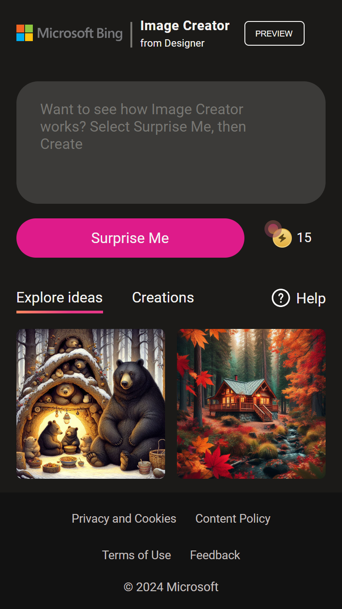
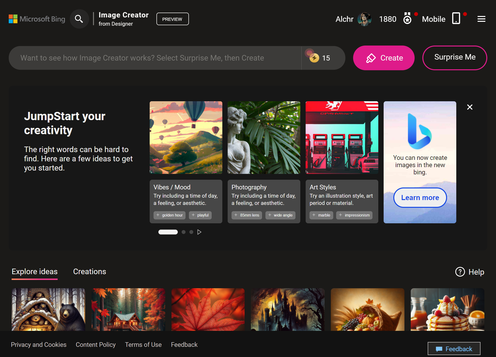

# 📚 Documentación del Proyecto: Clon de Image Creator para Microsoft Designer

[English version](./README.md)

Este proyecto es un reto personal que me propuse para aplicar mis conocimientos en un entorno real. El objetivo era crear un clon de Image Creator para Microsoft Designer utilizando principalmente HTML, CSS y un poco de JavaScript.

## 📱 Vista móvil

## 🖥️ Vista de escritorio

## 🚀 Tecnologías Utilizadas

El stack tecnológico de este proyecto incluye:

- HTML
- CSS
- JavaScript

Para el desarrollo de JavaScript, utilicé recursos externos y análisis de la web original. Aunque no domino completamente JavaScript, pude lograr el resultado deseado gracias a mi sentido de la lógica.

## 🎨 Propiedades Aplicadas

A lo largo del proyecto, apliqué diversas propiedades y técnicas, incluyendo:

- Propiedades Lógicas de CSS
- Flexbox de CSS
- Grid de CSS
- Posiciones
- Animaciones
- Transiciones
- Clip-path
- Propiedades personalizadas
- Gradientes
- Media Queries (Diseño Responsivo)
- BEM (Block Element Modifier)
- JavaScript

## 🤔 Reflexiones y Mejoras

A través de este proyecto, pude identificar áreas de mejora y logros personales:

- **Uso de `div` y `span`**: He superado mi temor al uso de `div` y `span` en la maquetación. Sin embargo, trato de evitar la *divitis* para mantener mi código limpio, accesible y útil para otros.

- **Nomenclatura BEM**: Estoy buscando una forma óptima y amigable de nombrar las clases sin que sean demasiado largas. He probado dos variantes de BEM y continuaré explorando otras opciones.

- **Propiedades personalizadas**: Estoy trabajando en la organización y definición de propiedades personalizadas, como los nombres de colores y sus variantes, el peso de las fuentes, los gradientes, los tamaños de letra, entre otros. En este proyecto, intenté replicar la forma en que Tailwind CSS maneja estas propiedades.

## 📝 Notas Finales

Este proyecto fue un desafío ya que anteriormente solo había creado componentes pequeños. Aunque estoy consciente de que hay formas de optimizar y reducir el código, estoy orgulloso de lo que he logrado. Mi mayor desafío es superar el miedo, y estoy trabajando en ello. Si estás leyendo esto, agradecería cualquier ayuda, consejo u observación que puedas ofrecer. Todo esto será de gran utilidad para mi crecimiento profesional.

## 🔗 Enlace al proyecto

[Visita mi proyecto aquí](https://alchrdev.github.io/ms-designer-ui-clon/)

