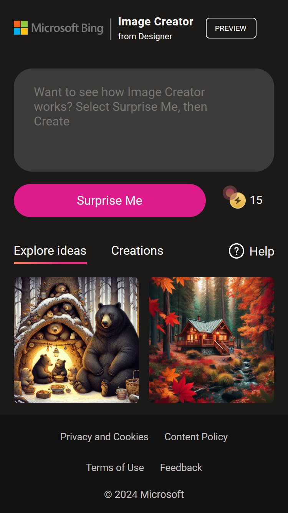

# 📚 Project Documentation: Image Creator for Microsoft Designer Clone

[Spanish version](./README.es.md)

This project is a personal challenge that I set myself to apply my knowledge in a real environment. The goal was to create a clone of Image Creator for Microsoft Designer using mainly HTML, CSS and a little bit of JavaScript.

## 📱 Mobile View

## 🖥️ Desktop View

## 🚀 Technologies Used

The technology stack of this project includes:

- HTML
- CSS
- JavaScript

For the development of JavaScript, I used external resources and analysis of the original web. Although I do not master JavaScript completely, I was able to achieve the desired result thanks to my sense of logic.

## 🎨 Properties Applied

Throughout the project, I applied various properties and techniques, including:

- CSS Logical Properties
- CSS Flexbox
- CSS Grid
- Positions
- Animations
- Transitions
- Clip-path
- Custom Properties
- Gradients
- Media Queries (Responsive Design)
- BEM (Block Element Modifier)
- JavaScript

## 🤔 Reflections and Improvements

Through this project, I was able to identify areas of improvement and personal achievements:

- **Use of `div` and `span`**: I have overcome my fear of using `div` and `span` in the layout. However, I try to avoid *divitis* to keep my code clean, accessible and useful for others.

- **BEM Nomenclature**: I am looking for an optimal and friendly way of naming the classes without being too long. I have tried two variants of BEM and I will continue to explore other options.

- **Custom Properties**: I am working on the organization and definition of custom properties, such as the names of colors and their variants, the weight of the fonts, the gradients, the font sizes, among others. In this project, I tried to replicate the way Tailwind CSS handles these properties.

## 📝 Final Notes

This project was a challenge since I had previously only created small components. Although I am aware that there are ways to optimize and reduce the code, I am proud of what I have achieved. My biggest challenge is to overcome fear, and I am working on it. If you are reading this, I would appreciate any help, advice or observation that you can offer. All this will be very useful for my professional growth.

## 🔗 Link to the project

[Visit my project here](https://alchrdev.github.io/image-creator-clone/)

